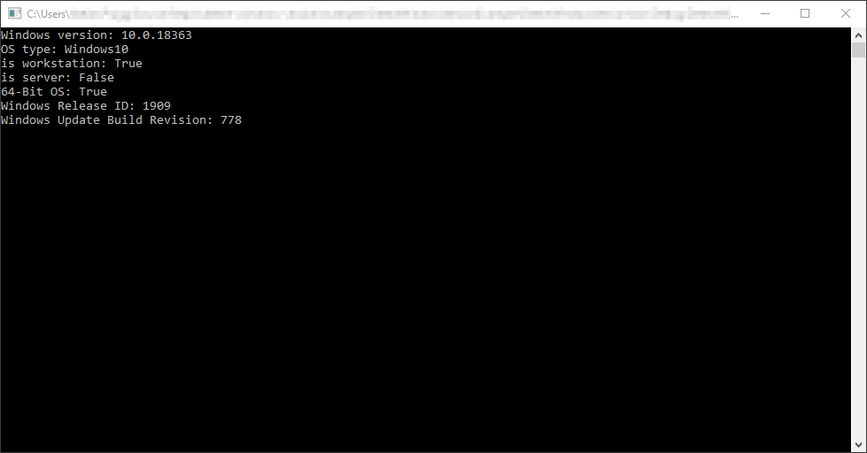

# Properly detect Windows version in C# .NET – even Windows 10
Shows various ways to determine the Windows version including calling RtlGetVersion in ntdll.dll. It is available starting with Windows 2000 and also works on Windows 10/Server 2019/Server 2016 right away.

# List of detected operating systems

The class can return the OS as an enum. 

<pre><code class='language-cs'>
    public enum OperatingSystem
    {
        Unknown,
        Windows2000,
        WindowsXP,
        WindowsXPProx64,
        WindowsHomeServer,
        WindowsServer2003,
        WindowsServer2003R2, 
        WindowsVista,
        WindowsServer2008,
        WindowsServer2008R2,
        Windows7,
        WindowsServer2012,
        Windows8,
        Windows81,
        WindowsServer2012R2,    
        WindowsServer20162019,  
        Windows10               
    }
</code></pre>

| Operating system  | tested | remarks |
| ------------- | ------------- | -------------  |
| Windows 10  | yes  | 1909 (build 18363), 1903 (build 18362), 1809 (build 17763)  |
| Windows Server 2019  |yes  |   |
| Windows Server 2016  | -  |   |
| Windows Server 2012 R2  | yes  |   |
| Windows 8.1  | yes  | x64  |
| Windows 8  | -  |   |
| Windows 7  | yes  | x86  |
| Windows Server 2008 R2  | -  |   |
| Windows Server 2008  | -  |   |
| Windows Vista  | -  |   |
| Windows Server 2003 R2  | yes  |   |
| Windows Server 2003  | -  |   |
| Windows Home Server  | -  |   |
| Windows XP 64-Bit Edition  | -  |   |
| Windows XP  | -  |   |
| Windows 2000  | -  |   |

# Target framework
NET Framework 4 (as one of the checks calls Environment.Is64BitOperatingSystem). Yet, you can inject your own environment provider, which runs on lower versions.

# Technical information
Please refer to https://www.prugg.at/2019/09/09/properly-detect-windows-version-in-c-net-even-windows-10/
